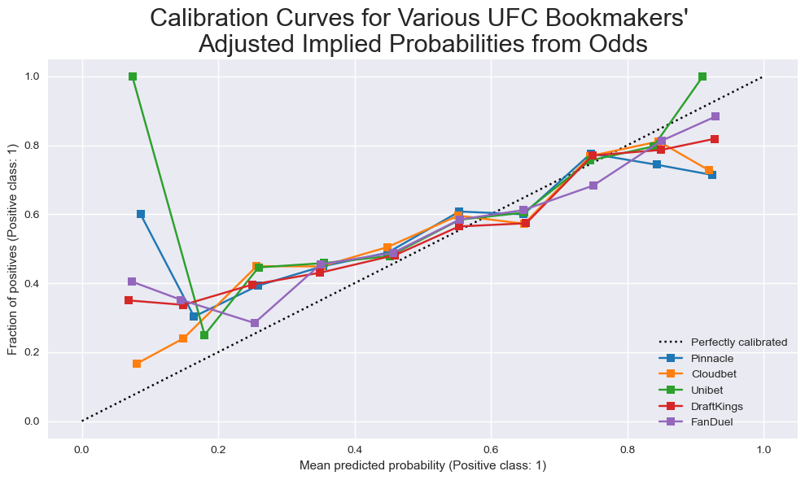

# UFC-Predict

## Motivation

Apply machine learning and optimization techniques to generate alpha in the UFC betting market.

## Background Information

### The UFC

### Betting Odds

### Probability Calibration

### How Good are the Bookies?

The following figure and table come from a sample of ~1300 bouts for five different and well-known bookmakers, and they capture important information regarding how well-calibrated the closing odds are for each bookmaker as well as their average house edge (which a bettor would need to overcome in order to consistently make profit).

The adjusted implied probability refers to the red corner fighter's implied probability of victory factoring out the bookmaker's house edge. The number of bins used is 10. In general, we see that the calibration curves follow pretty closely to the ideal line, but there are some deviations near the tails, especially when the red corner fighter is an underdog.

| Bookmaker  | Log Loss | Brier Score Loss | Expected Calibration Error | Mean Vig (House Edge) (%) |
| :--------: | :------: | :--------------: | :------------------------: | :-----------------------: |
| Pinnacle   | 0.667268 | 0.235607         | 0.069449                   | 4.71                      |
| Cloudbet   | 0.658231 | 0.231745         | 0.071669                   | 5.23                      |
| Unibet     | 0.666562 | 0.236587         | 0.055590                   | 5.37                      |
| DraftKings | 0.663200 | 0.228608         | 0.081700                   | 5.75                      |
| FanDuel    | 0.647257 | 0.223520         | 0.071133                   | 5.25                      |

The idea is that if we can develop a model that produces probability predictions that are better calibrated than those from bookmakers, we have an edge.

## Data

As of writing, the project leverages data from the following sources:
- [UFC Stats](http://ufcstats.com/statistics/events/completed): Bout and fighter statistics
- [Tapology](https://www.tapology.com/fightcenter): Bout and fighter statistics, some of which are not available on the UFC Stats website
- [UFC Rankings](https://www.ufc.com/rankings): Fighter rankings
- [FightOdds.io](https://fightodds.io/upcoming-mma-events/ufc): Betting odds

---
*This project is actively in development and a huge WIP. As such, the README will be updated accordingly.*
